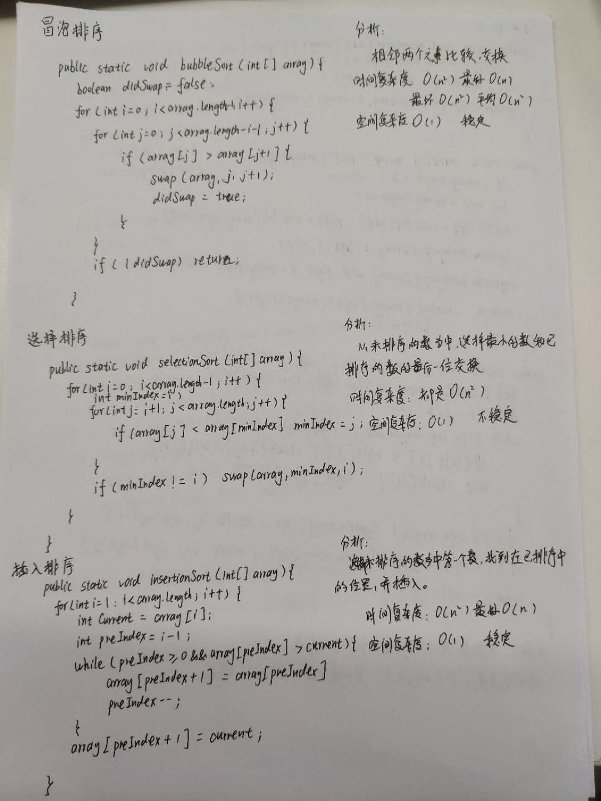
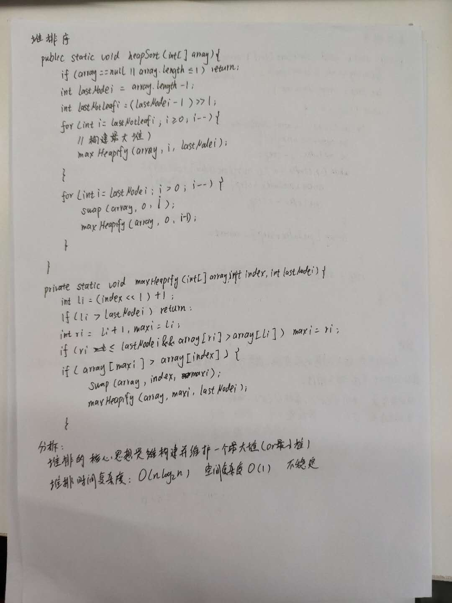
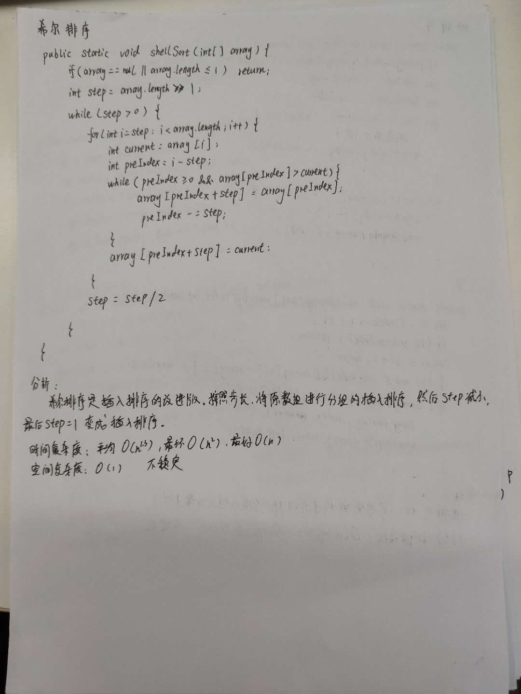
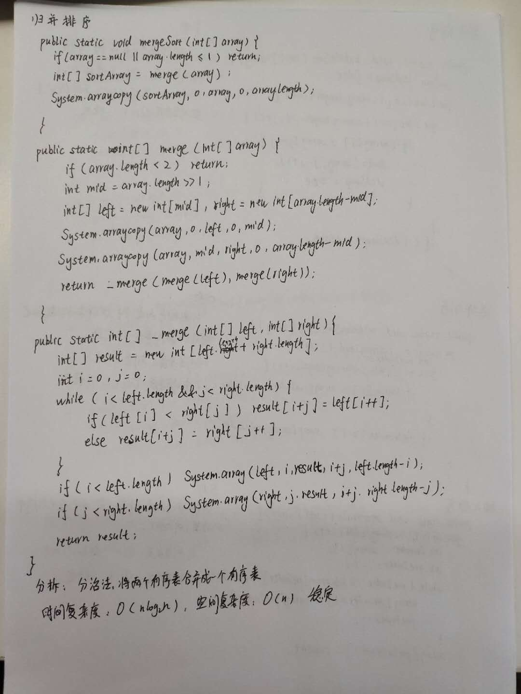
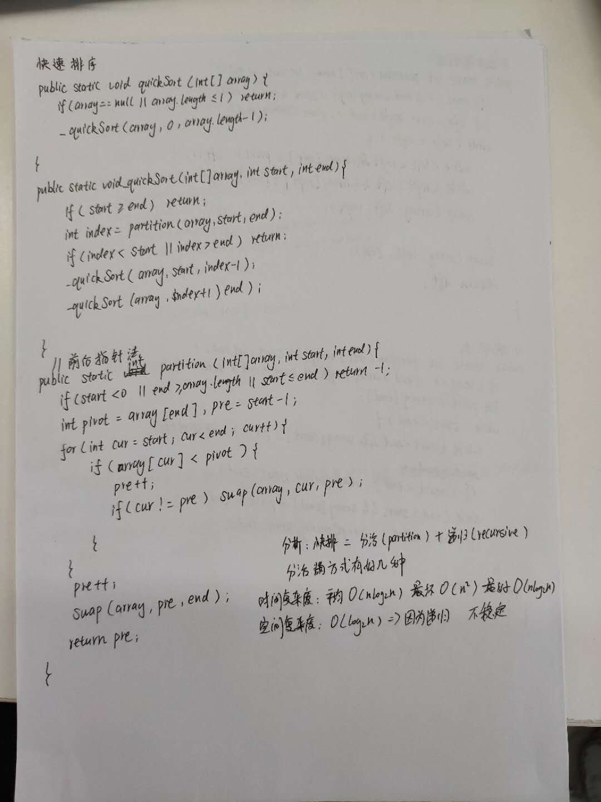
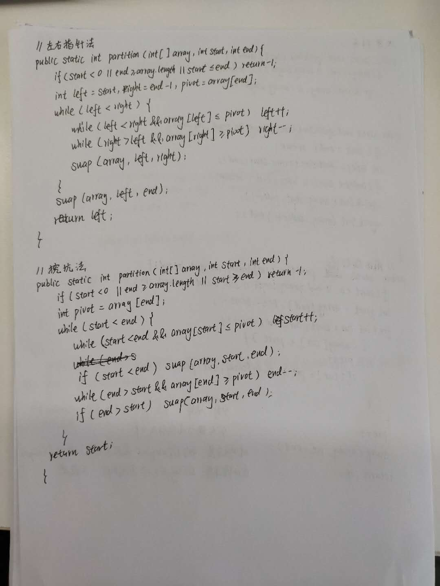

# 排序算法

## 排序算法实现

冒泡排序    [Java实现](./java/BubbleSort.java)  [Python3实现](./python/BubbleSort.py)

选择排序    [Java实现](./java/SelectionSort.java)  [Python3实现](./python/SelectionSort.py)

插入排序    [Java实现](./java/InsertionSort.java)  [Python3实现](./python/InsertionSort.py)

希尔排序    [Java实现](./java/ShellSort.java)  [Python3实现](./python/ShellSort.py)

归并排序    [Java实现](./java/MergeSort.java)  [Python3实现](./python/MergeSort.py)

快速排序    [Java实现](./java/QuickSort.java)  [Python3实现](./python/QuickSort.py)

堆排序      [Java实现](./java/HeapSort.java)  [Python3实现](./python/HeapSort.py)

## 手写排序

